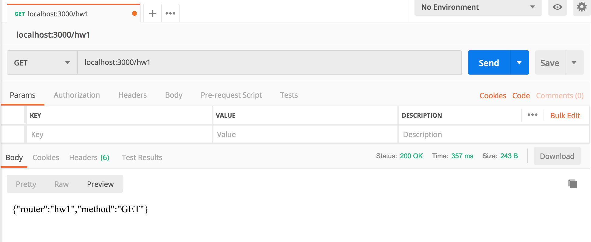
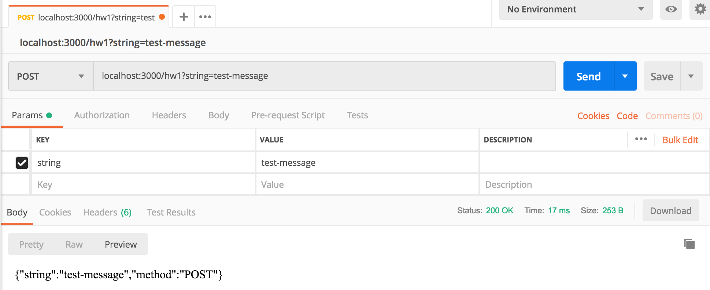

# CS591 Mean Assignment 2

[Assignment Instruction PDF](https://learn.bu.edu/bbcswebdav/pid-6685751-dt-content-rid-25938882_1/courses/19sprgcascs591_d1/CS412%20Homework%201.pdf)

Command line to display npm installed packages
```zsh
npm list -g --depth 0
```

[Guide for express-generator](https://expressjs.com/en/starter/generator.html)

Command line to display the tree ignoring node_modules
```zsh
tree -I node_modules
```

Get request to /hw1


Post request to /hw1

